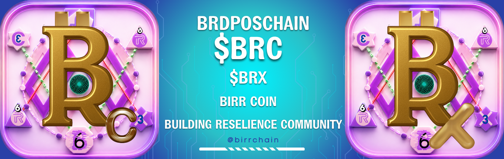

# BRDPoSChain

> **Production Layer 1 • Chain ID 3669 • ~3s Block Time • Independent Network • Full EVM Compatibility**

  

<h2 align="center">
The Protocol Powering BirrChain
</h2>

An independent, EVM-compatible Layer 1 blockchain engineered for digital identity, 
financial infrastructure, decentralized applications, payments, governance, 
and global value exchange.

<a href="https://birr.foundation">🌐 Website</a> •
<a href="https://birr.foundation/docs">📚 Documentation</a> •
<a href="https://birr.foundation/explorer">🔍 Explorer</a> •
<a href="https://rpc.birr.foundation">⚡ RPC</a>

---

# The Financial Operating System for the Internet

BRDPoSChain is the production blockchain protocol behind **BirrChain**, an independent Layer 1 blockchain designed to provide the infrastructure for digital identity, financial services, decentralized applications, governance, payments, remittance, and digital ownership.

Rather than building another cryptocurrency, BirrChain was engineered as a complete blockchain ecosystem where individuals, businesses, developers, and institutions can build, transact, and innovate on a unified protocol.

---

# Network Specifications

| Property | Value |
|-----------|-------|
| Network | Production Mainnet |
| Protocol | BRDPoSChain |
| Chain ID | **3669** |
| Native Coin | **BRC** |
| Reward Token | **BRX** |
| Average Block Time | ~3 Seconds |
| Consensus | BRDPoS |
| Current Validators | 5 |
| Validator Roadmap | 5 → 28 → 108 |
| Smart Contracts | Solidity / EVM Compatible |

---

# Core Principles

## Independent Layer 1

BRDPoSChain operates as a fully independent blockchain network with its own validator infrastructure, consensus protocol, networking layer, governance model, and execution environment.

It is **not a Layer 2** and **not dependent on Ethereum**, while maintaining full compatibility with the Ethereum Virtual Machine (EVM), allowing developers to use familiar Ethereum tooling and smart contracts.

---

## Full EVM Compatibility

Build using the tools you already know.

Supported developer stack includes:

- Solidity
- Hardhat
- Foundry
- MetaMask
- ethers.js
- web3.js
- OpenZeppelin

Deploy Ethereum-compatible smart contracts with minimal changes.

---

## Financial Infrastructure

BirrChain provides the building blocks for modern decentralized financial systems.

The ecosystem includes:

- Digital Identity
- Self-Custody Wallet
- Payments
- Remittance
- Staking
- Governance
- Tokenized Assets
- Developer APIs
- Smart Contracts
- Cross-Chain Infrastructure

---

## Token DNA

Token DNA is BirrChain's deterministic transaction fingerprinting system.

It provides independently verifiable cryptographic fingerprints for supported BRC and BRX transactions, enabling searchable provenance, analytics, and transaction traceability without modifying blockchain consensus.

---

# Protocol Architecture

BRDPoSChain introduces a hierarchical protocol architecture consisting of:

- Validators
- Epochs
- SuperBlocks
- ClusterChains

This layered design supports protocol governance, validator incentives, scalability, deterministic finality, and future network evolution.

---

# Consensus

BRDPoS (Birr Delegated Proof of Stake) is the consensus protocol powering BRDPoSChain.

The protocol is designed around validator accountability, rapid block finality, energy efficiency, and progressive decentralization.

Validator expansion roadmap:

- **Current:** 5 Production Validators
- **Phase I:** 28 Validators
- **Protocol Capacity:** 108 Validators

---

# Validator Identity

For enterprise and consortium deployments, BRDPoSChain supports optional validator identity verification.

Validator identity enables:

- Enterprise participation
- Institutional trust
- Regulatory compliance where required
- Consortium governance
- Validator accountability

Network governance may revoke validator status when identity verification requirements are violated according to protocol governance rules.

---

# Enterprise Features

BRDPoSChain was designed to support enterprise-grade blockchain deployments.

Features include:

- Deterministic Finality
- High Throughput
- Identity-Aware Validators
- Governance Framework
- Modular Architecture
- Upgradeable Protocol Design
- Public / Private Interoperability
- Consortium Support

---

# Developer Resources

### Website

https://birr.foundation

### Documentation

https://birr.foundation/docs

### Explorer

https://birr.foundation/explorer

### RPC Endpoint

https://rpc.birr.foundation

---

# Continuous Integration

Continuous integration, testing, and deployment pipelines are maintained through the project's CI/CD infrastructure.

See:

https://github.com/BirrFoundation/BRDPoSChain/tree/dev-upgrade/cicd

---

# Contributing

We welcome contributions from:

- Protocol Engineers
- Blockchain Developers
- Cryptographers
- Security Researchers
- Validator Operators
- Infrastructure Engineers
- Documentation Contributors

If you would like to contribute:

1. Fork the repository.
2. Create a feature branch.
3. Commit your changes with clear documentation.
4. Submit a Pull Request describing your implementation and motivation.

Every contribution is reviewed to ensure it aligns with the long-term vision, architecture, and security standards of BRDPoSChain.

---

# Community

🌐 **Website**

https://birr.foundation

📚 **Documentation**

https://birr.foundation/docs

🔍 **Explorer**

https://birr.foundation/explorer

⚡ **RPC**

https://rpc.birr.foundation

💬 **Telegram**

https://t.me/Building_Resilience_Community

𝕏 **X (Twitter)**

https://x.com/Birrchain

---

# License

See the LICENSE file for licensing information.

---

## The Financial Operating System for the Internet

**Inspect. Build. Contribute.**

